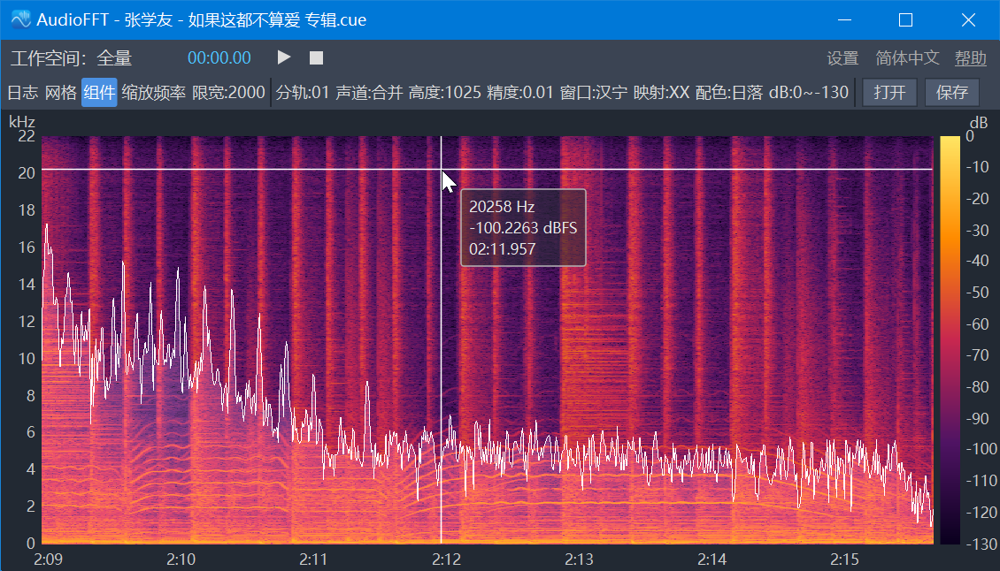
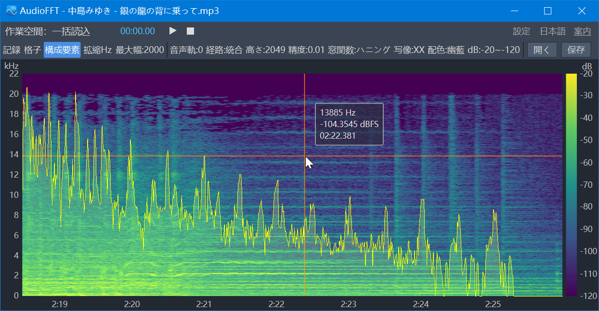
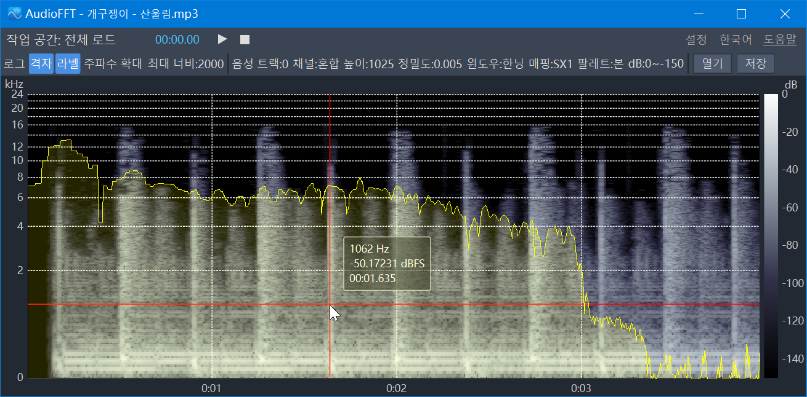
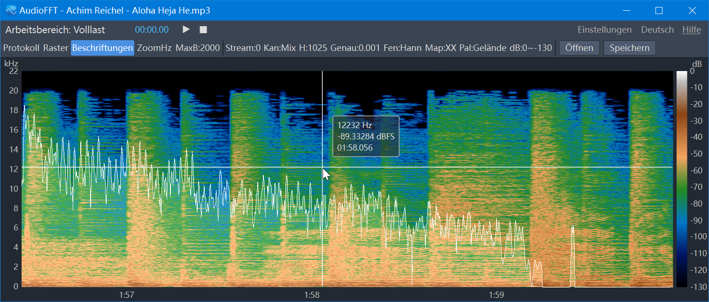
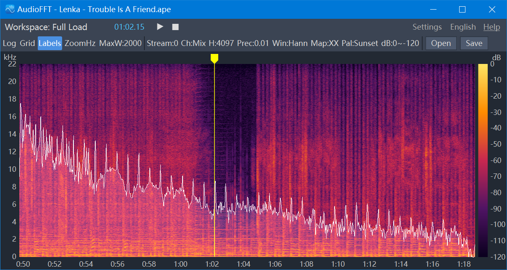
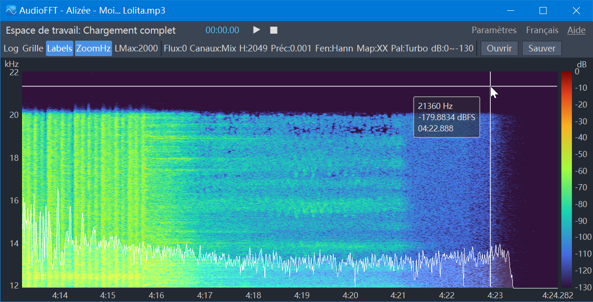
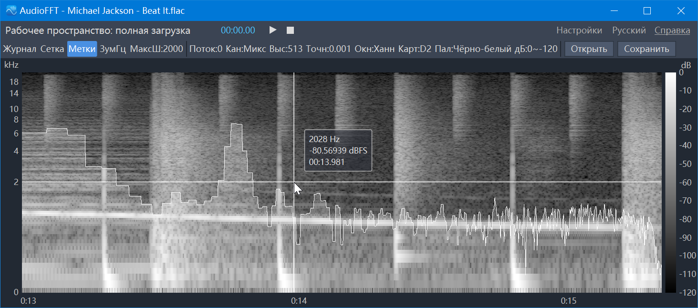
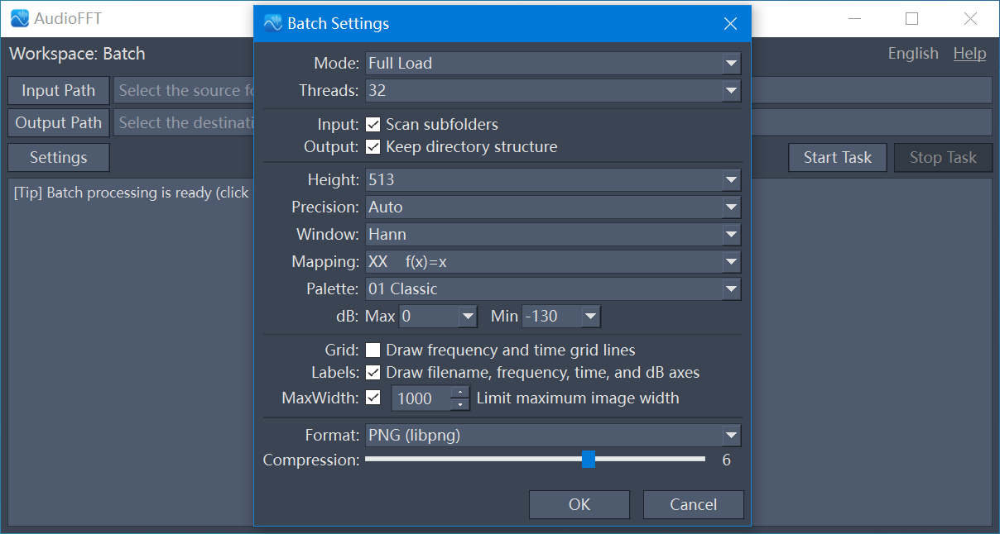
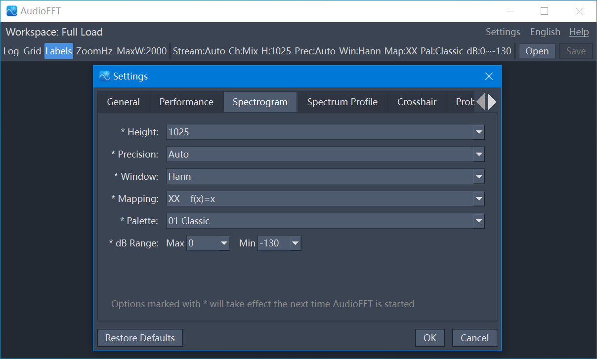

# AudioFFT


**AudioFFT** is an audio spectrum viewing and exporting tool that converts files containing audio streams into high-quality visualized spectrograms.

Built with **Qt 6**, **FFmpeg**, and **FFTW3**, AudioFFT delivers lightning-fast parallel decoding, extreme precision, and a fluid interactive interface.











---

## Table of Contents

- [Features](#features)
- [Download & Installation](#download--installation)
- [User Manual](#user-manual)
  - [Workspace](#workspace)
  - [Single File Analysis](#single-file-analysis)
  - [Batch Processing](#batch-processing)
- [Changelog](#changelog)
- [Build from Source](#build-from-source)
- [Third-Party Assets & Licenses](#third-party-assets--licenses)


---

## Features

*   Supports multiple audio formats.
*   Interactive spectrogram viewer.
*   Supports parameter adjustment.
*   Supports multiple image formats.
*   Supports batch processing.

---

## Download & Installation

### For Windows Users
1.  Navigate to the **[Releases](../../releases)** page on the right side of this repository.
2.  Download the latest `AudioFFT_v1.1_Win-x64.zip`.
3.  Extract the ZIP file to any folder.
4.  Run `AudioFFT.exe`. No installation is required(If it fails to start (or reports missing DLLs), please install the **Microsoft Visual C++ Redistributable (`vc_redist.x64.exe`)**).

---

## User Manual

### Workspace

*   **Full Load**: Loads the entire audio file into memory for the fastest processing speed, suitable for analyzing regular-sized files.
*   **Streaming**: Reads, processes, and renders in chunks with extremely low memory usage, ideal for super-long audio files or computers with limited resources.
*   **Batch**: Generates spectrograms in batches, with built-in Full Load and Streaming dual modes.

### Single File Analysis

#### View and Display Controls
*   **Log**: Opens an independent log window to display file information and processing progress in real-time.
*   **Grid**: Overlays frequency and time grid lines on the spectrogram to assist with alignment and reading.
*   **Labels**: Enables peripheral information (axes, title, etc.) around the spectrogram.
*   **ZoomHz (Zoom Frequency)**: Unlocks frequency axis zooming.
*   **MaxW (Max Width)**: Limits the maximum pixel width of the exported image. It will be auto-resized when exceeding the width limit.

#### Audio and Image Parameters
*   **Stream/Track**: Switches the audio stream in multi-stream files; if a `.cue` file is loaded, it becomes **Track** (CUE Track).
*   **Ch (Channel)**: Selects a specific channel, or choose "Mix" to mix all channels.
*   **H (Height)**: Sets the vertical pixel height of the image.
*   **Prec (Precision)**: Sets the horizontal time resolution (seconds/pixel). When set to "Auto", the window overlap rate is 0%.
*   **Win (Window)**: Selects the window function for the Fourier transform to control spectral leakage and sidelobe attenuation.
*   **Map (Mapping)**: Selects the scaling curve for the frequency axis (Y-axis) to easily focus on specific frequency bands.
*   **Pal (Palette)**: Selects the color theme for the spectral energy.
*   **dB**: Sets the upper and lower limits (dB) of the mapped energy.
*   **Open**: Opens files containing audio streams as well as CUE files.
*   **Save**: Exports the spectrogram as an image, with customizable compression level and image quality.

### Batch Processing

*   **Input/Output Path**: Sets the source folder and destination folder.
*   **Settings**: Opens the batch task configuration center. You can specify the **Mode** (Full Load / Streaming), **Threads**, FFT parameters, image export format, image quality, and other options.
*   **Task Control**: Controls the task via **Start Task**, **Pause Task / Resume Task**, and **Stop Task** buttons.

---

## Changelog

### V1.1 (2026-03-28)

**New**
*   Added streaming processing.
*   Added multi-threaded decoding for FLAC, ALAC, and DSD formats.
*   Added adaptive 32/64-bit floating-point computation precision.
*   Added dynamic memory loading strategy for full mode.
*   Added track switching.
*   Added support for opening CUE files.
*   Added CUE split-track switching.
*   Added channel switching.
*   Added FFT window function selection.
*   Added spectrogram color scheme selection.
*   Added spectrogram dB value adjustment.
*   Added caching mechanism for Fourier transform computation results.
*   Added duplicate task reminder for batch processing.
*   Added player with latency compensation.
*   Added adjustable crosshair cursor.
*   Added probe with switchable data source.
*   Added frequency distribution graph display.
*   Added GPU hardware acceleration.
*   Added component show/hide control.
*   Added frame rate adjustment.
*   Added I/O scheduling for batch processing.
*   Added screenshot functionality.
*   Added settings panel.
*   Added user configuration saving.
*   Added multi-language support: Simplified Chinese, Traditional Chinese, Japanese, Korean, German, English, French, and Russian.
*   Expanded the range of height values and added original FFT point-to-point resolution values.
*   Expanded the range of time precision values and added automatic zero-overlap rate.
*   Expanded the number of mapping functions.

**Optimizations**
*   Optimized audio decoding speed.
*   Optimized Fourier transform speed.
*   Optimized spectrogram rendering speed.
*   Optimized log content and layout.
*   Optimized the logic and smoothness of spectrogram zooming and panning.
*   Changed the user interface to Ribbon style.

**Fixes**
*   Fixed errors in multi-threaded decoding for APE format.
*   Fixed inaccurate audio duration display for some files.
*   Fixed FFmpeg resource leaks.
*   Fixed program crashes caused by thread contention.
*   Fixed program crashes caused by Fourier transform during batch processing.
*   Fixed save failures in batch processing when image size exceeded format limits.

### V1.0 (2025-12-21)

*   Supports two working modes: single-file and batch processing.
*   Supports the vast majority of common audio formats.
*   Spectrogram supports panning and zooming.
*   Preset multiple frequency mapping functions.
*   Spectrogram height and time precision can be adjusted.
*   Provides grid for easy alignment and viewing.
*   Supports exporting to multiple image formats.
*   Exported images allow adjustment of quality and compression ratio.
*   Supports custom maximum image width.
*   Provides log viewing.

---

## Build from Source

**Requirements:**
*   **OS**: Windows 10/11 x64
*   **Compiler**: MSVC (Visual Studio 2019 or 2022) with C++17 support.
*   **CMake**: 3.18+
*   **vcpkg**: Required for dependency management.
*   **Qt**: 6.9.2+

**Dependencies (Managed via vcpkg):**
`ffmpeg`, `fftw3`, `libpng`, `zlib`, `libjpeg-turbo`, `tiff`, `openjpeg`, `libwebp`, `libavif`.

**Steps:**

Assuming your source is in C:\AudioFFT and vcpkg is installed at C:\vcpkg and Qt is installed at C:\Qt:


```cmd
cd C:\AudioFFT\build

cmake .. -DCMAKE_TOOLCHAIN_FILE=C:\vcpkg\scripts\buildsystems\vcpkg.cmake -DCMAKE_PREFIX_PATH=C:\Qt\6.9.2\msvc2022_64

cmake --build . --config Release

C:\Qt\6.9.2\msvc2022_64\bin\windeployqt.exe C:\AudioFFT\build\Release\AudioFFT.exe
```

---

## Third-Party Assets & Licenses

AudioFFT uses the following third-party assets:

| Component | Purpose | License |
| :--- | :--- | :--- |
| **Qt 6** | Graphical user interface (GUI) | GNU LGPL version 3 |
| **FFmpeg** | Audio decoding and playback | GNU LGPL version 2.1 or later |
| **FFTW3** | Fast Fourier Transform (FFT) | GNU GPL version 2 or later |
| **libjpeg-turbo** | JPEG image encoding | IJG |
| **libpng** | PNG image encoding | libpng/zlib |
| **zlib** | Data compression (dependency of libpng) | zlib |
| **libtiff** | TIFF image encoding | BSD-style |
| **OpenJPEG** | JPEG 2000 image encoding | BSD 2-Clause |
| **libwebp** | WebP image encoding | BSD 3-Clause |
| **libavif** | AVIF image encoding | BSD 2-Clause |
| **libaom** | Image encoding (dependency of libavif) | BSD 2-Clause |

---
*Developed with ❤️ by Emma Winter.*
