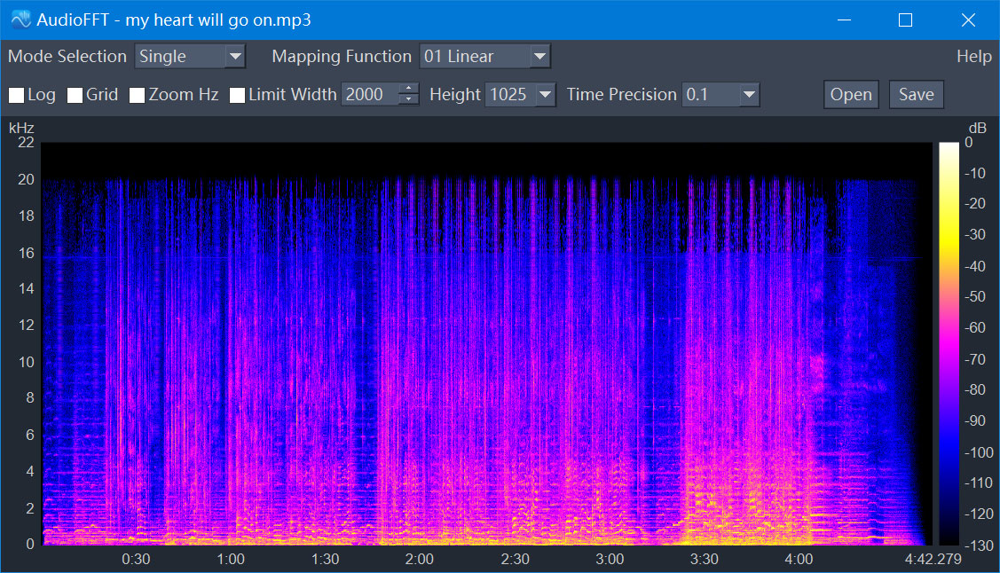

# AudioFFT


**AudioFFT** is a high-performance, open-source audio spectrum analysis tool. It converts audio files into high-resolution visual spectrograms, supporting both interactive single-file analysis and massive automated batch processing.

Built with **C++17**, **Qt 6**, **FFmpeg**, and **FFTW3**.



---

## Table of Contents
1.  [Features](#features)
2.  [Download & Installation](#download--installation)
3.  [User Manual](#user-manual)
    *   [Single File Mode](#single-file-mode)
    *   [Batch Processing Mode](#batch-processing-mode)
    *   [Configuration Parameters](#configuration-parameters)
4.  [Important Notes & Troubleshooting](#important-notes--troubleshooting)
5.  [Build from Source](#build-from-source)
6.  [Credits & License](#credits--license)

---

## Features

*   **Broad Format Support**: Powered by **FFmpeg**, supports MP3, FLAC, WAV, APE, AAC, OGG, M4A, DSD, and more.
*   **High-Precision FFT**: Uses **FFTW3** with Hann windowing for accurate frequency analysis and decibel (dB) calculation.
*   **Dual Operation Modes**:
    *   **Single Mode**: Interactive viewer with real-time zooming, panning, and grid overlays.
    *   **Batch Mode**: Multi-threaded engine with load balancing to process thousands of files automatically.
*   **Professional Export**:
    *   Direct integration with `libpng`, `libjpeg-turbo`, `libwebp`, and `libavif` for optimal compression.
    *   Supports exporting up to **10,000px** width (or unlimited if hardware allows).
*   **Customizable Visualization**: 
    *   13 different **Mapping Curves** (Linear, Logarithmic, Sinusoidal, Cubic, etc.) to adjust frequency distribution.
    *   Adjustable time precision (up to 0.01s).

---

## Download & Installation

### For Windows Users
1.  Navigate to the **[Releases](../../releases)** page on the right side of this repository.
2.  Download the latest `AudioFFT_v1.0_Win-x64.zip`.
3.  Extract the ZIP file to any folder.
4.  Run `AudioFFT.exe`. No installation is required(If it fails to start (or reports missing DLLs), please install the **Microsoft Visual C++ Redistributable (`vc_redist.x64.exe`)**).

---

## User Manual

### Single File Mode
Designed for detailed inspection of individual audio tracks.

1.  **Load Audio**: Drag and drop an audio file into the window or click the **"Open"** button.
2.  **Navigation**:
    *   **Pan**: Click and drag the spectrogram to move around.
    *   **Zoom**: Use the mouse wheel to zoom in/out on the time axis.
    *   **Vertical Zoom**: Check the **"Zoom Hz"** box to enable simultaneous frequency axis zooming.
3.  **Export**: Configure your desired height and precision, then click **"Save"**.

### Batch Processing Mode
Designed for converting entire music libraries into images.

1.  **Select Paths**:
    *   **Input Path**: Select the folder containing your audio files.
    *   **Output Path**: Select where you want the images to be saved.
    *   *Option*: Check **"Scan Subfolders"** to process recursively.
    *   *Option*: Check **"Keep Structure"** to mirror the folder hierarchy in the output.
2.  **Output Settings**:
    *   Select the image format (e.g., PNG, JPG, WebP, AVIF).
    *   Adjust compression/quality sliders (if applicable).
3.  **Start**: Click **"Start Task"**. The log window will show the progress of each thread.

### Configuration Parameters

These settings apply to both modes:

*   **Height**: The vertical resolution of the generated image (e.g., 1025px, 4097px). Higher values show more frequency detail but consume more RAM.
*   **Time Precision**: The time interval between FFT columns (e.g., 0.1s, 0.01s).
    *   *0.1s*: Standard detail, faster processing.
    *   *0.01s*: Extreme detail, generates very wide images, requires significant RAM.
*   **Width Limit**:
    *   If checked, images wider than the set value (e.g., 1000px) will be downscaled to fit. Useful for creating thumbnails.
*   **Mapping Function** (Top Toolbar):
    *   Controls how frequencies are distributed on the Y-axis.
    *   *01 Linear*: Even spacing (standard).
    *   *02/03 Log*: Expands low frequencies (bass) and compresses high frequencies. Recommended for music analysis.

---

## Important Notes & Troubleshooting

### 1. Memory Usage Warning (OOM)
AudioFFT decodes the entire audio stream into memory (`float` PCM format) to ensure maximum processing speed. 
*   **Risk**: Processing extremely long audio files (e.g., >1 hour at 192kHz) combined with high settings (e.g., `0.01s` precision) can exhaust your system RAM (Out of Memory).
*   **Solution**: If the application crashes on a specific file, try increasing the "Time Precision" value (e.g., from 0.05 to 0.1) or reducing the "Height".

### 2. APE Format Specifics
*   **Single Mode**: Uses a special **parallel decoding** strategy to speed up loading. This result in tiny visible "stitching seams" (artifacts) .
*   **Batch Mode**: Uses **single-threaded decoding** for APE files. This ensures absolute safety and perfect waveform continuity, though it may be slightly slower per file.

### 3. Image Export Limits
*   **PNG**: If the generated image exceeds ~24 million pixels, a warning may appear as saving will take time.
*   **JPG**: Has a hard limit of 65,535 pixels per side.
*   **WebP**: Has a hard limit of 16,383 pixels per side.
*   **AVIF**: Has a hard limit of 8,192 pixels per side.
*   *Note*: If your generated spectrogram exceeds these format limits, the software will attempt to downscale it automatically or fail gracefully.

---

## Build from Source

**Requirements:**
*   **OS**: Windows 10/11 x64
*   **Compiler**: MSVC (Visual Studio 2019 or 2022) with C++17 support.
*   **CMake**: 3.18+
*   **vcpkg**: Required for dependency management.
*   **Qt**: 6.9.2+

**Dependencies (Managed via vcpkg):**
`ffmpeg`, `fftw3`, `libpng`, `zlib`, `libjpeg-turbo`, `tiff`, `openjpeg`, `libwebp`, `libavif`.

**Steps:**
1.  **Download the AudioFFT Source code:**

    Download the AudioFFT source code from GitHub.

2.  **Configure using CMake and vcpkg:**
    ```x64 Native Tools Command Prompt for VS 2022
    cd [path_to_AudioFFT]\build
    
    cmake .. -DCMAKE_TOOLCHAIN_FILE=[path_to_vcpkg]\scripts\buildsystems\vcpkg.cmake -DCMAKE_PREFIX_PATH=[path_to_Qt]\Qt\6.9.2\msvc2022_64
    ```

3. **Build:**
    ```x64 Native Tools Command Prompt for VS 2022
    cmake --build build --config Release
    ```


4.  **Deploy:**

    The executable will be in `build/Release`. You may need to run `windeployqt` or manually copy the required DLLs to run the application outside the IDE.
    ```x64 Native Tools Command Prompt for VS 2022
    [path_to_Qt]\Qt\6.9.2\msvc2022_64\bin\windeployqt.exe C:\[path_to_AudioFFT]\build\Release\AudioFFT.exe
    ```

---

## Credits & License

**AudioFFT** is free software licensed under the **GNU General Public License v3.0 (GPLv3)**.

This software relies on the following excellent open-source projects:

*   **[Qt 6](https://www.qt.io/)**: GUI Framework (LGPLv3).
*   **[FFmpeg](https://ffmpeg.org/)**: Audio decoding and stream handling (LGPLv2.1+).
*   **[FFTW3](http://www.fftw.org/)**: Fastest Fourier Transform in the West (GPLv2+).
*   **Image Libraries**: `libpng` (PNG Reference Library), `libjpeg-turbo`, `libtiff`, `OpenJPEG`, `libwebp`, `libavif`.


*Developed with ❤️ by Emma Winter.*
