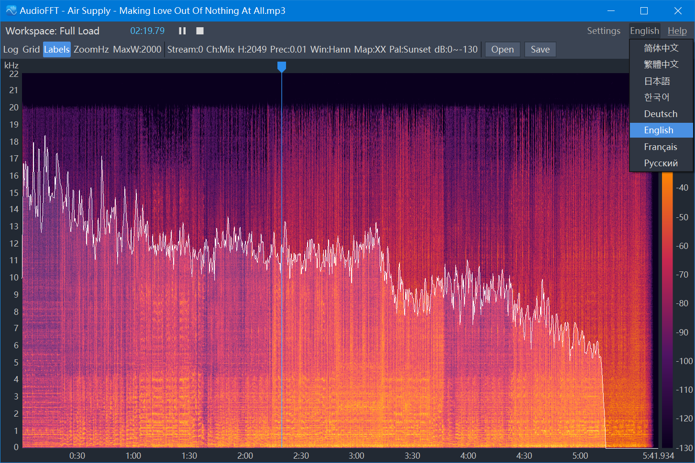
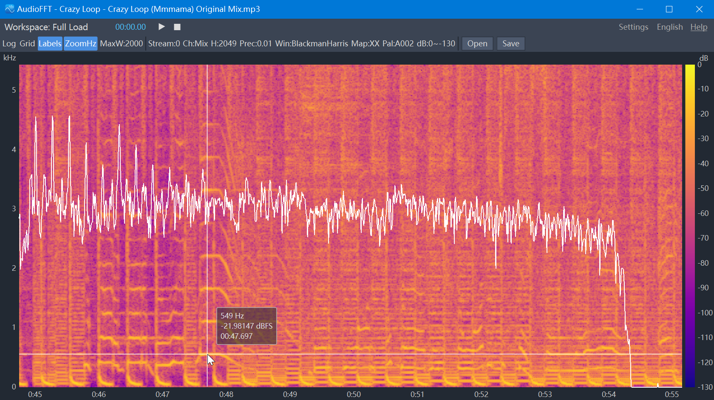
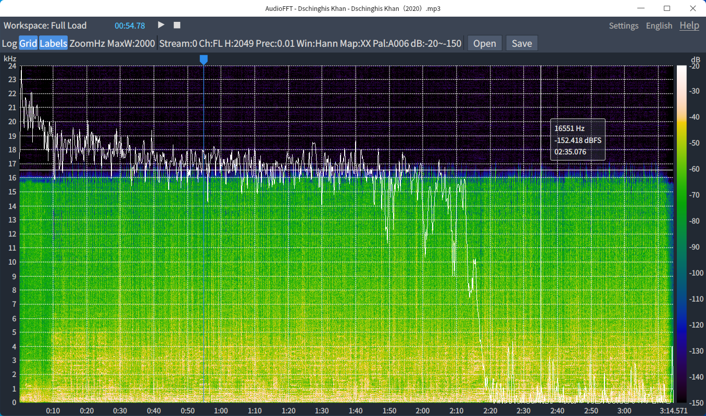

# AudioFFT


**AudioFFT** — High-Performance Audio Spectrogram Analyzer & Batch Export Powerhouse.

Quickly convert **any audio file** into **high-resolution spectrograms**, with full support for **interactive single-file analysis** + **massive batch processing**.

Built with **Qt 6 + FFmpeg + FFTW3**, every step — decoding, FFT computation, and rendering — is extremely optimized. Supports ultra-long audio streaming, GPU hardware acceleration, and a multi-language interface.







---

## Table of Contents

- [Features](#features)
- [Download & Installation](#download--installation)
- [User Manual](#user-manual)
  - [Workspace](#workspace)
  - [Single File Analysis](#single-file-analysis)
  - [Batch Processing](#batch-processing)
- [Changelog](#changelog)
- [Build from Source](#build-from-source)
- [Third-Party Assets & Licenses](#third-party-assets--licenses)

---

## Key Features

- **Supports nearly all audio formats** (FLAC, ALAC, DSD, APE, CUE track splitting, and more).
- **Interactive spectrogram viewer**: real-time zoom, pan, crosshair cursor, frequency distribution graph.
- **Ultra-low memory streaming mode**: silky-smooth analysis even for extremely long audio files.
- **Powerful batch processing**: one-click folder export, multi-threaded, with Full Load / Streaming dual modes.
- **Rich adjustable parameters**: window functions, frequency mapping, color palettes, dB range, precision, channel mixing, and more.
- **Multi-language interface**: 简体中文, 繁體中文, 日本語, 한국어, Deutsch, English, Français, Русский.
- **GPU hardware acceleration**: intelligent caching for blazing-fast performance.

---

## Download & Installation

### For Windows Users
1. Navigate to the **[Releases](../../releases)** page of this repository.
2. Download the latest `AudioFFT_v1.3_Win-x64.zip`.
3. Extract the ZIP file to any folder.
4. Run `AudioFFT.exe`. No installation is required.

Note: 
If it fails to start, crashes silently when loading a file, or reports missing `*.dll` files.
Please install the `vc_redist.x64.exe` ([Microsoft Visual C++ Redistributable](https://aka.ms/vs/17/release/vc_redist.x64.exe)).

### For Deepin Linux Users
1. Navigate to the **[Releases](../../releases)** page of this repository.
2. Download the latest `AudioFFT_v1.3_Linux-Deepin-x64.zip`.
3. Extract the ZIP file to any folder.
4. Run `AudioFFT`.

### For Other Linux Users
See the [Build from Source](#build-from-source) section below. (A `.desktop` launcher is automatically integrated).

---

## User Manual

### Workspace

*   **Full Load**: Loads the entire audio file into memory for the fastest processing speed, suitable for analyzing regular-sized files.
*   **Streaming**: Reads, processes, and renders in chunks with extremely low memory usage, ideal for super-long audio files or computers with limited resources.
*   **Batch**: Generates spectrograms in batches, with built-in Full Load and Streaming dual modes.

### Single File Analysis

#### View and Display Controls
*   **Log**: Opens an independent log window to display file information and processing progress in real-time.
*   **Grid**: Overlays frequency and time grid lines on the spectrogram to assist with alignment and reading.
*   **Labels**: Enables peripheral information (axes, title, etc.) around the spectrogram.
*   **ZoomHz (Zoom Frequency)**: Unlocks frequency axis zooming.
*   **MaxW (Max Width)**: Limits the maximum pixel width of the exported image. It will be auto-resized when exceeding the width limit.

#### Audio and Image Parameters
*   **Stream/Track**: Switches the audio stream in multi-stream files; if a `.cue` file is loaded, it becomes **Track** (CUE Track).
*   **Ch (Channel)**: Selects a specific channel, or choose "Mix" to mix all channels.
*   **H (Height)**: Sets the vertical pixel height of the image.
*   **Prec (Precision)**: Sets the horizontal time resolution (seconds/pixel). When set to "Auto", the window overlap rate is 0%.
*   **Win (Window)**: Selects the window function for the Fourier transform to control spectral leakage and sidelobe attenuation.
*   **Map (Mapping)**: Selects the scaling curve for the frequency axis (Y-axis) to easily focus on specific frequency bands.
*   **Pal (Palette)**: Selects the color theme for the spectral energy.
*   **dB**: Sets the upper and lower limits (dB) of the mapped energy.
*   **Open**: Opens files containing audio streams as well as CUE files.
*   **Save**: Exports the spectrogram as an image, with customizable compression level and image quality.

### Batch Processing

*   **Input/Output Path**: Sets the source folder and destination folder.
*   **Settings**: Opens the batch task configuration center. You can specify the **Mode** (Full Load / Streaming), **Threads**, FFT parameters, image export format, image quality, and other options.
*   **Task Control**: Controls the task via **Start Task**, **Pause Task / Resume Task**, and **Stop Task** buttons.

---

## Changelog

### V1.3 (2026-07-25)

**New**
*   Added several FFT window functions.
*   Added several dBFS color palettes.
*   Added option to invert color palettes.
*   Added option to apply negative colors to palettes.
*   Added indexed color format for PNG and BMP images.
*   Added support for user-defined custom color palettes.
*   Added system media controls for Windows 10/11.
*   Added system media controls for Linux.
*   Added storage structure analysis module for Linux.
*   Added ".desktop" launcher installation for Linux.
*   Added character encoding detection.
*   Added option to automatically expand the spectrogram upon playback.

**Optimizations**
*   Refactored the color palette module.
*   Adjusted some default parameters.
*   Adjusted window stacking properties on Linux.
*   Adjusted the audio file association logic for CUE files.
*   Adjusted build configurations for MSVC and GCC compiler compatibility.
*   Decoupled the lifecycle of the player's stop operation and progress reset.
*   Improved global FFTW resource cleanup routines.
*   Implemented explicit memory release mechanisms for Linux.
*   Optimized external file path parsing on Linux.
*   Optimized the libpng export algorithm.
*   Optimized the FFT algorithm.
*   Optimized the frequency domain mapping algorithm.
*   Optimized the loop nesting order for spectrogram rendering.
*   Optimized memory management of the audio resampler.
*   Optimized memory pre-allocation logic for multi-threaded decoding.
*   Optimized data transfer in CPU rendering mode.
*   Optimized GPU vertex buffer updates.
*   Optimized the construction logic of dynamic vertices on the GPU.

**Fixes**
*   Fixed an issue where the spectrum profile always drew the first frame.
*   Fixed an issue where the player unexpectedly stopped playback.
*   Fixed an issue where the FFT cache could not be automatically cleared.
*   Fixed a memory spike vulnerability during data merging in multi-threaded decoding.
*   Fixed an unaligned memory error in the FFmpeg decoder.
*   Fixed data races and program crashes related to FFTW.
*   Fixed a memory leak in the PNG encoder.
*   Fixed uncontrollable crashes in the PNG error callback.
*   Fixed a dangling pointer crash risk in the screenshot feature.
*   Fixed an error in the COM evaluation logic within the storage analysis module.
*   Fixed a division-by-zero error in window functions.
*   Fixed an issue where the GPU rendering module crashed under extreme conditions.
*   Fixed build failures caused by cross-platform incompatibilities.
*   Fixed visual tearing issues with the playhead.
*   Fixed audio-visual desynchronization issues in the player.
*   Fixed an issue where screenshots were captured with a visual offset.
*   Fixed anchor point recognition anomalies in APE parallel decoding.
*   Fixed a vulnerability where batch processing could trigger an infinite loop for APE files.
*   Fixed an issue where logs were omitted during batch processing.
*   Fixed playback blocking issues when switching workspaces on Linux.
*   Fixed a permanent deadlock when exceptions occurred during batch processing.
*   Fixed memory access violation crashes when stopping tasks or exiting the application.

---

## Build from Source

**Requirements:**
*   **OS**: Windows 10/11 x64, Linux x64
*   **Compiler**: MSVC (Visual Studio 2019 or 2022) with C++17 support, GCC or Clang with C++17 support.
*   **CMake**: 3.18+
*   **vcpkg**: Required for dependency management.
*   **Python**: 3.0 +
*   **Qt**: 6.9.2+
*   **FFmpeg**: 7.1 / 8.0 / 8.1

**Dependencies (Managed via vcpkg):**
`ffmpeg`, `fftw3`, `libpng`, `zlib`, `libjpeg-turbo`, `tiff`, `openjpeg`, `libwebp`, `libavif`, `libaom`, `libyuv`.

**Steps: Windows**

Assuming your source is in C:\AudioFFT and vcpkg is installed at C:\vcpkg and Qt is installed at C:\Qt:


```cmd
cd C:\AudioFFT\build

cmake .. -DCMAKE_TOOLCHAIN_FILE=C:\vcpkg\scripts\buildsystems\vcpkg.cmake -DCMAKE_PREFIX_PATH=C:\Qt\6.9.2\msvc2022_64

cmake --build . --config Release

C:\Qt\6.9.2\msvc2022_64\bin\windeployqt.exe C:\AudioFFT\build\Release\AudioFFT.exe
```

**Steps: Linux**

Clone AudioFFT source form github.com


```cmd
cd "/path/to/AudioFFT"

mkdir build && cd build

cmake .. -DCMAKE_BUILD_TYPE=Release -DCMAKE_TOOLCHAIN_FILE="/path/to/vcpkg/scripts/buildsystems/vcpkg.cmake"

make -j$(nproc)
```

---

## Third-Party Assets & Licenses

AudioFFT uses the following third-party assets:

| Component | Purpose | License |
| :--- | :--- | :--- |
| **Qt 6** | GUI & Cross-platform framework | LGPL v3 |
| **FFmpeg** | Audio decoding & multimedia processing | LGPL v2.1+ |
| **FFTW3** | Fast Fourier Transform computation | GPL v2+ |
| **libpng / zlib** | PNG image encoding & compression | libpng/zlib |
| **libjpeg-turbo** | JPEG image encoding | IJG / BSD-style / zlib |
| **libtiff** | TIFF image encoding | BSD-style |
| **OpenJPEG** | JPEG 2000 image encoding | BSD 2-Clause |
| **libwebp** | WebP image encoding | BSD 3-Clause |
| **libavif / libaom**| AVIF / AV1 image encoding | BSD 2-Clause |
| **libyuv** | Pixel format conversion & scaling | BSD 3-Clause |

AudioFFT includes stunning, perceptually uniform color maps created by the scientific community:
* **Matplotlib Perceptual Maps** by Stéfan van der Walt, Nathaniel Smith (BSD 2-Clause / CC0)
* **Turbo Colormap** by Anton Mikhailov / Google LLC (Apache 2.0)
* **Kindlmann Maps** by Gordon Kindlmann / Univ. of Chicago (BSD 2-Clause)
* **BentCW & SmoothCW** by Kenneth Moreland / Sandia National Laboratories (BSD 2-Clause)
* **Scientific Colour Maps** by Dr. Fabio Crameri (CC BY 4.0)
* **CET Perceptually Uniform Maps** by Peter Kovesi / CET UWA (CC BY 4.0)
* **SciVisColor & ColorBrewer** by Francesca Samsel / Cynthia Brewer (CC BY 4.0 / Apache 2.0)
